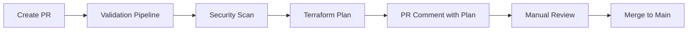
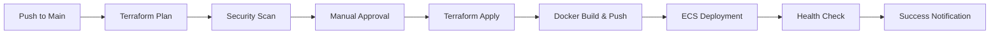

# 🚀 Deployment Guide

This project uses a comprehensive CI/CD pipeline for automated Terraform deployment to AWS ECS.

## 📋 Pipeline Overview

### 1. **Terraform Validation & Linting** (`tf-plan.yml`)
- **Triggers**: Pull requests to `main` branch with Terraform changes
- **Purpose**: Code quality and security validation
- **Steps**:
  - ✅ Checkov security scanning
  - ✅ Terraform format, init, validate
  - ✅ TFLint static analysis
  - ✅ Generate artifacts for review

### 2. **Terraform ECS Deployment** (`terraform-deploy.yml`)
- **Triggers**: 
  - Push to `main` branch
  - Manual workflow dispatch
  - Pull requests (plan only)
- **Purpose**: Complete infrastructure deployment
- **Environments**: dev, staging, prod

## 🔄 Deployment Workflow

### **Pull Request Process**


### **Production Deployment**


## ⚙️ Pipeline Jobs

### **Job 1: Validate**
- Terraform format check
- Terraform validation
- Generate and publish plan
- Comment plan details on PR

### **Job 2: Security Scan**
- Checkov infrastructure security scanning
- Upload security report artifacts
- Soft fail to allow review of issues

### **Job 3: Deploy**
- **Conditions**: 
  - Only runs on `main` branch pushes
  - Requires successful validation
  - Requires manual approval for production
- **Actions**:
  - Apply Terraform plan
  - Build and push Docker image to ECR
  - Deploy to ECS Fargate
  - Perform health checks
  - Report deployment URLs

### **Job 4: Cleanup**
- Remove sensitive Terraform plan artifacts
- Clean up temporary files

## 🔐 Security & Permissions

### **Required Secrets**
```yaml
AWS_ACCOUNT_ID: Your AWS Account ID
```

### **Required IAM Role**
- **Role Name**: `terraform-aws-ecs-webapp`
- **Trust Policy**: GitHub OIDC
- **Permissions**: 
  - ECS full access
  - ECR full access
  - VPC management
  - IAM role management
  - Load Balancer management
  - CloudWatch logs

### **GitHub Environments**
- **dev**: Automatic deployment
- **staging**: Manual approval required
- **production**: Manual approval required

## 🎯 Deployment Targets

### **Development**
- **Branch**: `main`
- **Trigger**: Automatic on push
- **Environment**: `dev`
- **Approval**: None required

### **Production**
- **Branch**: `main` 
- **Trigger**: Manual workflow dispatch
- **Environment**: `production`
- **Approval**: Required

## 📊 Pipeline Outputs

### **Successful Deployment**
- **Portfolio URL**: Load balancer endpoint
- **Snake Game**: `/game` endpoint
- **Health Check**: `/health` endpoint
- **ECR Repository**: Docker image location

### **Artifacts Generated**
- Terraform plans (temporary)
- Security scan reports
- TFLint analysis reports
- Deployment logs

## 🔧 Manual Deployment

If you need to deploy manually:

```bash
# Navigate to infrastructure directory
cd infra/

# Validate configuration
./validate.sh

# Initialize Terraform
terraform init

# Plan deployment
terraform plan

# Apply changes (with approval)
terraform apply
```

## 🚨 Troubleshooting

### **Common Issues**

1. **Authentication Errors**
   - Verify AWS_ACCOUNT_ID secret is set
   - Check IAM role trust policy
   - Ensure OIDC identity provider is configured

2. **Docker Build Failures**
   - Check Docker daemon is available in runner
   - Verify ECR permissions
   - Check Dockerfile syntax

3. **Health Check Failures**
   - Verify application starts correctly
   - Check security group rules
   - Confirm load balancer configuration

### **Debug Steps**

1. **Check pipeline logs** in GitHub Actions
2. **Review Terraform plan** output in PR comments
3. **Examine security scan** results in artifacts
4. **Verify AWS resources** in AWS Console
5. **Test application** endpoints manually

## 📈 Monitoring

### **Application Health**
- **Health Endpoint**: `https://your-alb-url/health`
- **Game Endpoint**: `https://your-alb-url/game`
- **Portfolio**: `https://your-alb-url/`

### **Infrastructure Monitoring**
- **CloudWatch Logs**: `/ecs/sohaib-portfolio`
- **ECS Metrics**: Container insights enabled
- **Load Balancer**: Target group health

## 🔄 Rollback Process

If deployment fails or issues arise:

1. **Immediate**: Use ALB to route traffic away
2. **Quick Fix**: Revert code changes and redeploy
3. **Full Rollback**: Use previous Terraform state
4. **Emergency**: Manual AWS Console intervention

## 🎉 Success Criteria

Deployment is successful when:
- ✅ Terraform apply completes without errors
- ✅ Docker image builds and pushes to ECR
- ✅ ECS service starts and passes health checks
- ✅ Load balancer returns 200 from `/health`
- ✅ Portfolio and game are accessible
- ✅ CloudWatch logs show application startup

---

*This deployment pipeline ensures reliable, secure, and automated infrastructure deployment for the Sohaib Sohail DevOps Portfolio application.*