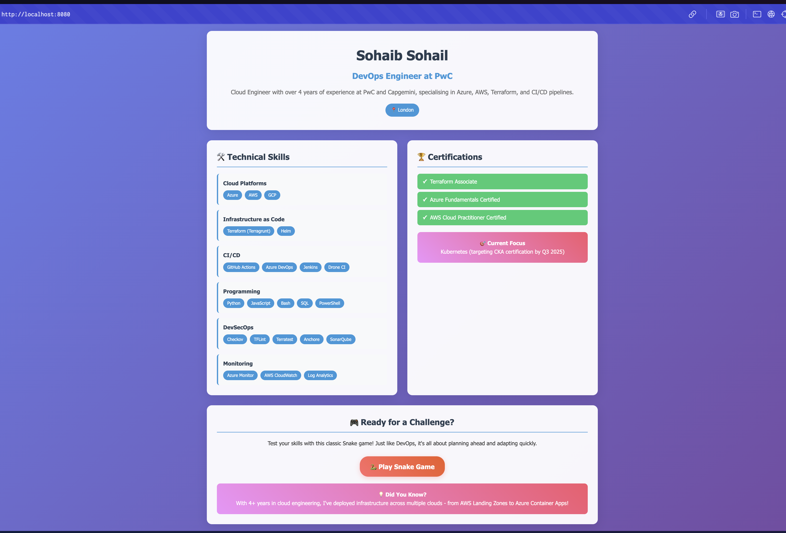
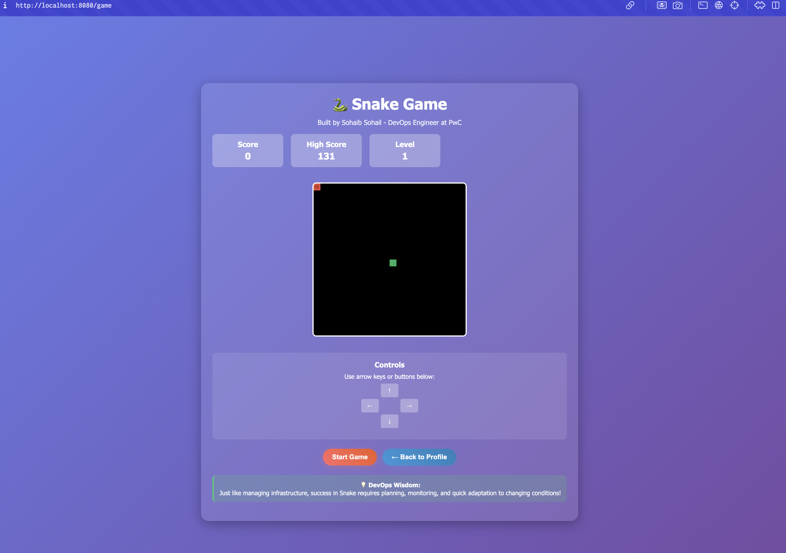
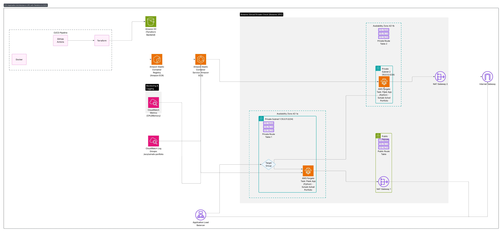

# Sohaib Sohail - DevOps Portfolio Application

## 🎯 Current Application

This repository showcases a **professional portfolio web application** for **Sohaib Sohail**, DevOps Engineer at PwC, featuring:

### 👨‍💻 Portfolio Features
- **Professional Profile**: Showcasing 4+ years of cloud engineering experience at PwC and Capgemini
- **Technical Skills Display**: AWS, Azure, Terraform, CI/CD, DevSecOps expertise
- **Certifications**: Terraform Associate, Azure Fundamentals, AWS Cloud Practitioner  
- **Interactive Snake Game**: DevOps-themed educational game with professional branding
- **Modern Responsive Design**: Clean, professional interface suitable for demonstrations

### 🐳 Application Stack
- **Backend**: Flask (Python) with RESTful API endpoints
- **Frontend**: Modern CSS with responsive design
- **Container**: Production-ready Docker configuration
- **Health Monitoring**: `/health` endpoint for ECS health checks
- **Game API**: Score tracking and management endpoints

### 📸 Application Demo

#### Portfolio Homepage


#### Interactive Snake Game


## 🏗️ Infrastructure Overview

A production-ready, highly available ECS Fargate web application infrastructure deployed on AWS using Terraform. Features modular design, auto-scaling, comprehensive monitoring, and security-first architecture.

### Architecture Diagram


### 📁 Project Structure
```
├── app.py                 # Main Flask application (Portfolio & Game)
├── requirements.txt       # Python dependencies
├── Dockerfile            # Production-ready container
├── templates/
│   ├── home.html         # Professional portfolio homepage
│   └── game.html         # Interactive Snake game
├── dvla_archive/         # Original DVLA application (Archived)
└── infra/               # Terraform infrastructure (MODULARIZED)
    ├── modules/         # Reusable infrastructure modules
    │   ├── vpc/         # VPC, subnets, networking
    │   ├── alb/         # Application Load Balancer
    │   ├── security/    # Security groups
    │   ├── ecs/         # ECS cluster and services
    │   ├── acm/         # SSL certificates
    │   └── route53/     # DNS and domain management
    ├── main.tf          # Module orchestration
    ├── ARCHITECTURE.md  # Infrastructure architecture guide
    ├── DEPLOYMENT.md    # Deployment instructions
    └── VARIABLES.md     # Variable reference
```

## 🔧 Recent Infrastructure Improvements

### Infrastructure Modularization (Latest Update)

The Terraform infrastructure has been **completely modularized** for better maintainability, reusability, and team collaboration:

#### ✅ What Changed
1. **Split monolithic code** into focused modules:
   - `modules/vpc/` - VPC, subnets, NAT gateways, route tables
   - `modules/alb/` - Application Load Balancer and target groups
   - `modules/security/` - Security groups for ALB and ECS tasks
   - `modules/ecs/` - ECS cluster, service, task definitions, auto-scaling, ECR
   - `modules/acm/` - SSL certificate management
   - `modules/route53/` - DNS zones and domain management

2. **Cleaned up variables** - Removed duplicate variables across modules
3. **Enhanced documentation** - Split into focused guides (see Documentation section)

#### 🎯 Benefits
- **Separation of Concerns**: Each module handles specific infrastructure domain
- **Reusability**: Modules can be reused across different environments
- **Team Collaboration**: Different teams can work on different modules
- **Easier Testing**: Modules can be tested independently
- **Clear Dependencies**: Well-defined inputs/outputs between modules

## 🚀 Quick Start

### Local Development
```bash
# Clone and setup
git clone <repo-url>
cd terraform-aws-ecs-webapp

# Local development
export FLASK_SECRET_KEY=$(python -c "import secrets; print(secrets.token_hex(32))")
pip install -r requirements.txt
python app.py
# Visit: http://localhost:5000
```

### Infrastructure Deployment
```bash
# Navigate to infrastructure
cd infra/

# Configure variables (edit terraform.tfvars)
# Initialize and deploy
terraform init
terraform plan
terraform apply
```

## 📚 Documentation

Comprehensive documentation has been split into focused guides:

| Document | Description |
|----------|-------------|
| [🚀 Quick Start](docs/QUICK-START.md) | Fast deployment guide |
| [🏗️ Infrastructure](docs/INFRASTRUCTURE.md) | Detailed AWS components |
| [🔧 Configuration](docs/CONFIGURATION.md) | Variable reference and setup |
| [🔧 Setup Guide](docs/SETUP.md) | Backend setup and CI/CD |
| [🔍 Troubleshooting](docs/TROUBLESHOOTING.md) | Common issues and solutions |
| [🔒 Security](docs/SECURITY.md) | Security features and best practices |
| [🏗️ Architecture](infra/ARCHITECTURE.md) | Module structure and dependencies |
| [🚀 Deployment](infra/DEPLOYMENT.md) | Infrastructure deployment guide |
| [📝 Variables](infra/VARIABLES.md) | Complete variable reference |

## 🌟 Key Features

### Infrastructure Highlights
- **AWS ECS Fargate**: Serverless container orchestration
- **Application Load Balancer**: High availability and traffic distribution
- **Multi-AZ Deployment**: Across public and private subnets
- **Auto-scaling**: Based on CPU and memory utilization
- **Comprehensive Monitoring**: CloudWatch and Container Insights
- **Security-first Architecture**: Least privilege access

### DevOps Best Practices
- **Infrastructure as Code**: Terraform with modular design
- **CI/CD Integration**: GitHub Actions workflow
- **Remote State Management**: S3 backend with encryption
- **Security Scanning**: Automated security validation
- **Comprehensive Documentation**: Split into focused guides

## 🔒 Security Features

- **Network Isolation**: ECS tasks in private subnets
- **Security Groups**: Least privilege access
- **IAM Roles**: Minimal permissions
- **Encryption**: State files and data at rest
- **Monitoring**: CloudWatch logs and metrics

## 📊 Monitoring & Scaling

- **Auto Scaling**: CPU and memory-based policies
- **CloudWatch**: Comprehensive logging and monitoring
- **Health Checks**: ALB and container-level monitoring
- **Container Insights**: Enhanced ECS metrics

## 🤝 Contributing

1. Fork the repository
2. Create a feature branch
3. Make changes and test thoroughly
4. Submit a pull request with detailed description
5. Ensure all CI checks pass

## 📄 License

This project is licensed under the MIT License - see the LICENSE file for details.

---

**Note**: This is a portfolio project demonstrating professional DevOps and cloud engineering capabilities. The infrastructure showcases production-ready patterns suitable for enterprise environments.